<html>
<h1>Desk Mate</h1>
   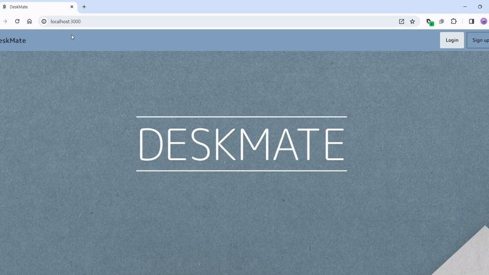
       <h4>Frontend Reposiery <a href="https://github.com/AhmedHosny2/Staff-Help-Desk-Frontend" target="_blank">Here</a></h4>
   <h3></h3>
       <h2>Demo</h2>
        <h4>You can watch a walkthrough of the website from <a href="" target="_blank">Here</a></h4>
    <h2>
    Table of contents
    </h2>
    <h3> 
        <ul>
            <li>Project Title</li>
            <li>Demo</li>
            <li>Table of contents</li>
            <li>Description</li>
            <li>Technology Stack</li>
            <li>Microservices and Ports</li>
            <li>Usage</li>
            <li>.env.example</li>
            <li>List of Features</li>
            <li>Preview</li>
            <li>Contributers</li>
        </ul>
    </h3>
     
    <h2>Description</h2>
    <h4>
Desk Mate is a Help Desk Software project designed with a microservices architecture, aimed at creating a robust application using the MERN stack (MongoDB, Express.js, React.js, Node.js), complemented by Tailwind CSS for streamlined and efficient styling. Focused on improving support and ticketing processes, the software incorporates features such as user management with role-based access, a comprehensive ticketing system for issue categorization and prioritization, an organized Knowledge Base for quick problem resolution, and communication tools including an integrated email and notification system and real-time chat functionality. Additionally, Desk Mate integrates an advanced AI chatbot, providing users with intelligent and instant assistance. The AI chatbot enhances the user experience by offering prompt responses and solutions. The system further includes responsive design for seamless usage across various devices, robust logs for real-time issue tracking, and Multi-Factor Authentication (MFA) to enhance overall security. Reporting and analytics features provide insights into ticket status, resolution time, and agent performance, while automation and workflows streamline repetitive tasks. The emphasis on customization, branding, security measures, and data protection ensures a well-rounded solution.
    </h4>
    <h2>Technology Stack</h2>
       <ul>
    <li>React.js - Frontend Framework</li>
    <li>Node.js with Express.js - Backend Framework</li>
    <li>MongoDB - Database</li>
    <li>Tailwind CSS - CSS Framework</li>
    <li>JSON Web Tokens (JWT) - Authentication</li>
    <li>Socket.io - Real-Time Communication </li>
    <li>JOI - Backend Input Validation</li>
</ul>
    <h2>Microservices and Ports</h2>
    <ul>
  <li>Users Microservice: Port 5001</li>
  <li>Tickets Microservice: Port 5002</li>
  <li>Notifications Microservice: Port 5003</li>
  <li>Chat Microservice: Port 5004</li>
  <li>Middleware Microservice: Port 5005</li>
  <li>Knowledge Base Microservice: Port 5006</li>
  <li>Logging Microservice: Port 5007</li>
  <li>Ticket Classifier Microservice: Port 5012</li>
  <li>Bot Microservice: Port 5008</li>
</ul>
    <h2>Usage</h2>
    <ol>
            <li>Clone this project</li>
            <li>Download Dependencies (MongoDB,node,react...)</li>
            <li>Make a .env file and use the .env.example</li>
            <li>Open terminal in the project folder then run python .\initializeAll.py</li>
            <li>Then run python .\runAll.py</li>
            <li>Clone the Front End files from this repo : <a href="https://github.com/AhmedHosny2/Staff-Help-Desk-Frontend" target="_blank">Link</a></li>
            <li>Open terminal in the front end project folder then run npm i command</li>
            <li>Make a .env file and use the .env.example from the frontend repositries</li>
            <li>Run npm start in the frontend folder and wait a min or two</li>
            <li>Enter in your browser http://localhost:3000/</li>
        </ol>
    <h2>.env.example</h2>

  CLIENT_URL="http://localhost:3000"  
  PORT=  
  CONNECTION_URL=  
  ACCESS_TOKEN_SECRET=  
  REFRESH_TOKEN_SECRET=  
  DOMAIN="localhost"  
  OPENAI_API_KEY=  
  DESKMATE_SENDGRID_API_KEY=  
  CLIENT_ID=  
  CLIENT_SECRET=  
  SESSION_SECRET=  
  DB_PASSWORD =  
  GOOGLE_DRIVE_CLIENT_ID =  
  GOOGLE_DRIVE_CLIENT_SECRET =   
  GOOGLE_DRIVE_REDIRECT_URI =  
  GOOGLE_DRIVE_REFRESH_TOKEN=  
  BACKUP_URI=  
  USER_BASE_URL= "http://localhost:5001/user/"  
  MIDDLEWARE_BASE_URL=  "http://localhost:5005/"  
  LOGGING_BASE_URL=  "http://localhost:5007/logging/"

    <h2>List of Features</h2>
<ul>
    <li>Ticketing System with Categorization and Prioritization</li>
    <li>Custom Workflow for Issue Reporting</li>
    <li>Knowledge Base with Organized Repository of FAQs and Solutions</li>
    <li>Integrated Email and Notification System</li>
    <li>Real-Time Chat Functionality for Immediate Assistance</li>
    <li>Reporting and Analytics on Ticket Status, Resolution Time, and Agent Performance</li>
    <li>Automation of Repetitive Tasks</li>
    <li>Customization of Help Desk's Appearance</li>
    <li>AI Chat Bot for imediate assistance</li>
    <li>Implementation of Security Measures including Encryption and Decryption of chat</li>
    <li>Data Backup and Recovery Procedures</li>
    <li>AI Ticket Routing System </li>
    <li>Multi-Factor Authentication (MFA) for Enhanced Security </li>
    <li>Error and Exception Logging for Robust Troubleshooting</li>
    <li>Rate Limiting for Logins and Other Sensitive Requests</li>
    <li>Progressive Web App</li>
    <li>Responsive Design for Seamless Usage Across Various Devices</li>
</ul>
    <h2>Preview</h2>
     
<h3>Home Page</h3>
 
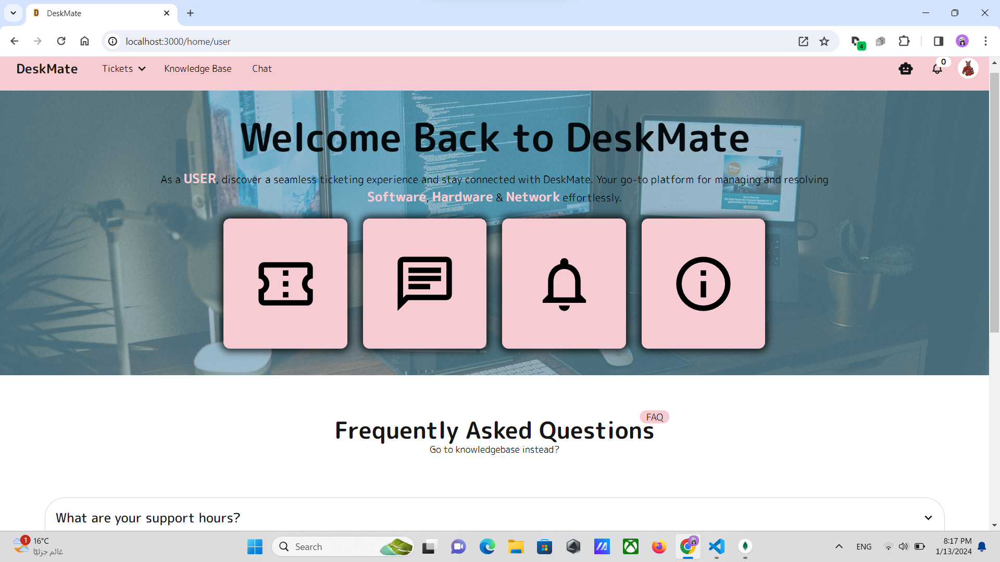
 

<h3>Profile Page</h3>
 
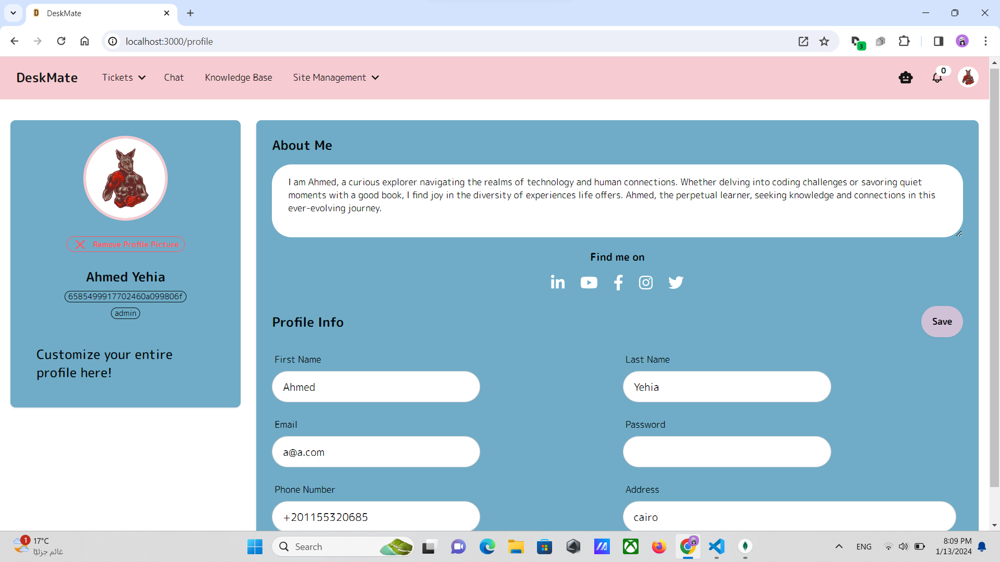
 

<h3>Create Ticket</h3>
 
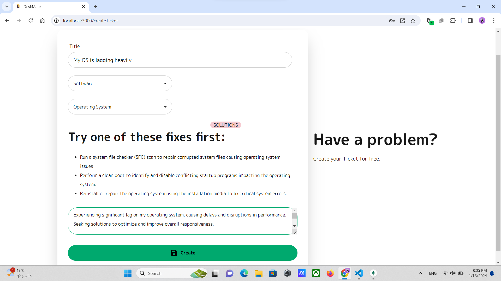
 

<h3>Tickets</h3>
 
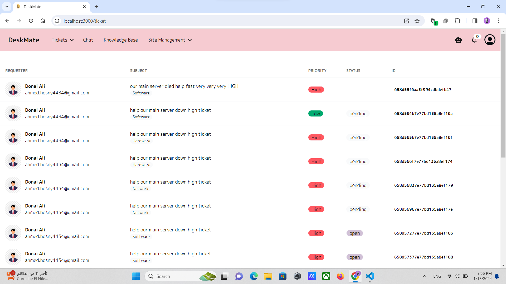
 

<h3>Ticket</h3>
 
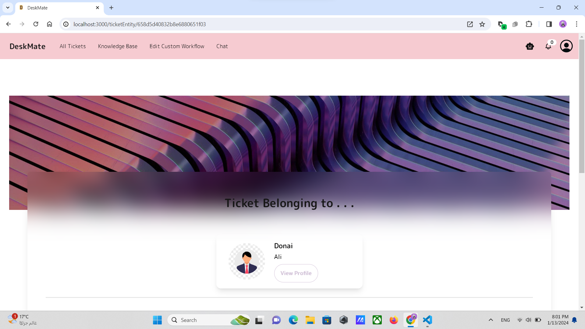
 
 
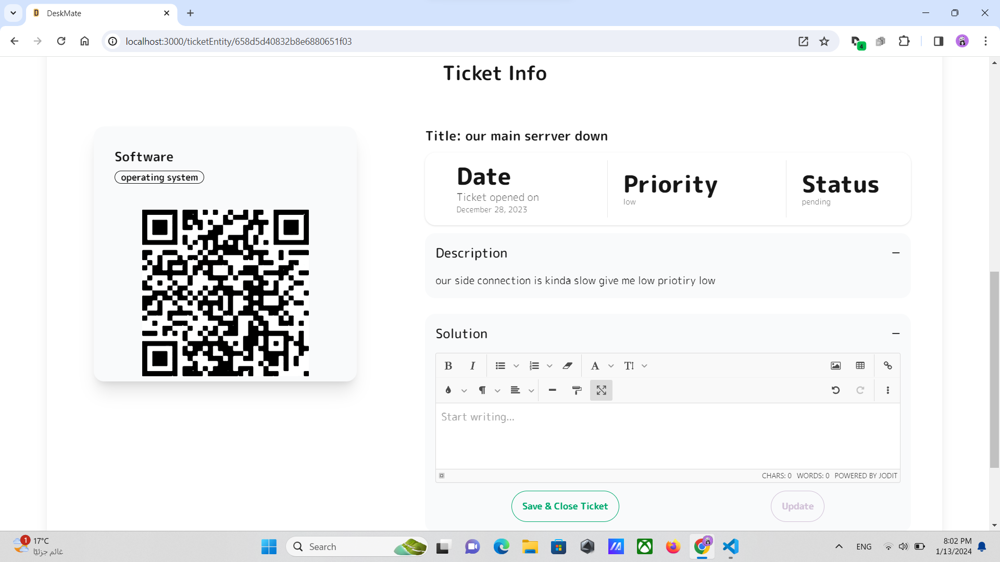
 

<h3>Knowledge Base</h3>
 
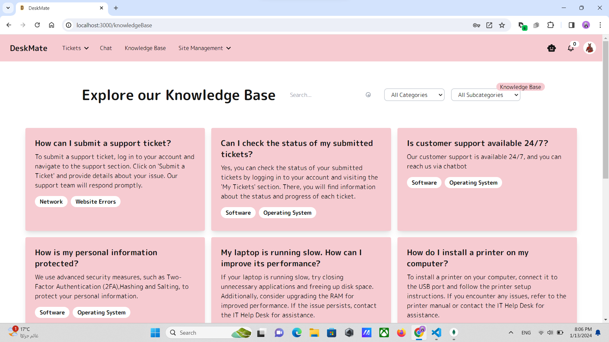
 

<!-- <h3>Chat</h3>
 

  -->

<h3>User Management</h3>
 
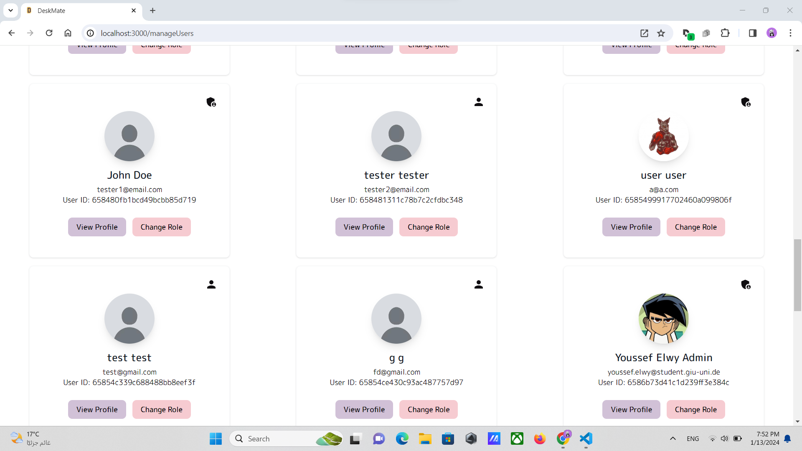
 

<h3>Website Customization</h3>
 
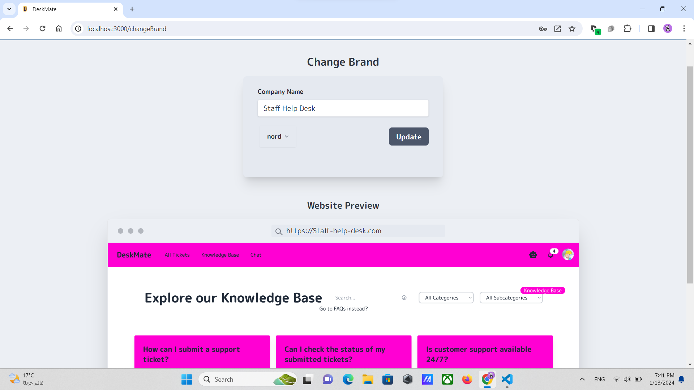
 

<h3>Reports</h3>
 
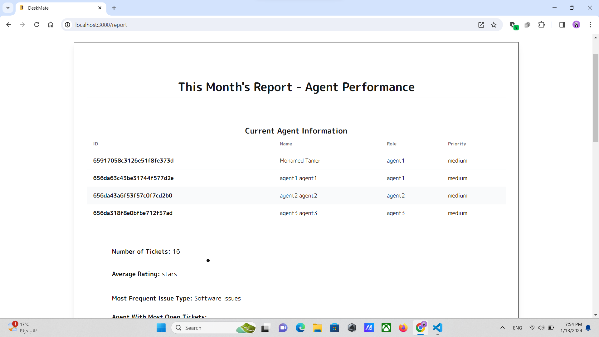
 
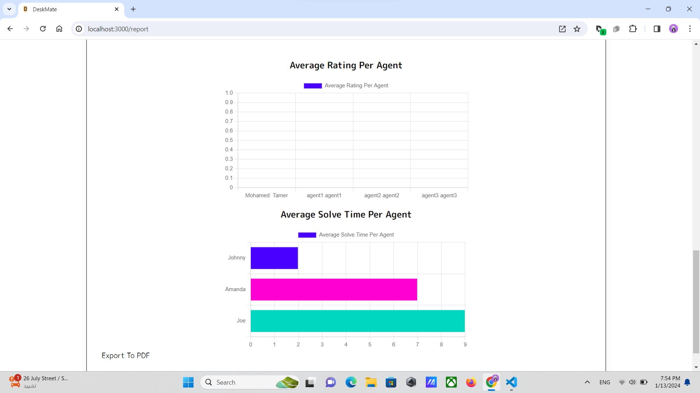
 

<h3>Chat Bot</h3>
 

 

<h3>Emails</h3>
 
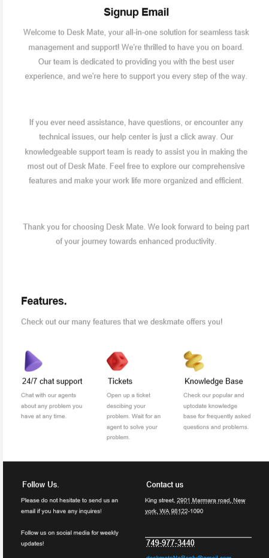
 

<h3>Multi-Factor Authentication</h3>
 
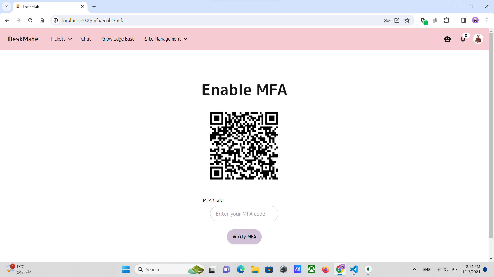
 
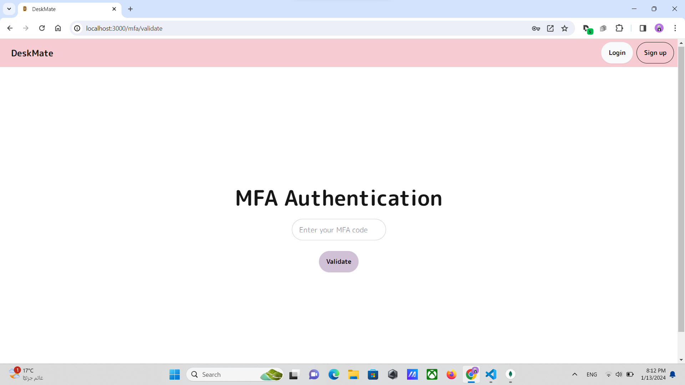
 

<h3>Logs</h3>
 
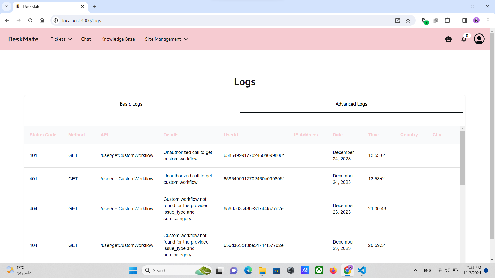
 
    <h2>Contributers</h2>
        <ul>
            <li>Ahmed Osama <a href="https://github.com/AhmedOsamaAli" target="_blank">Github</a> <a href="https://www.linkedin.com/in/ahmedosamadiab/" target="_blank">Linkedin</a></li>
            <li>Ahmed Yehia <a href="https://github.com/AhmedHosny2" target="_blank">Github</a> <a href="https://www.linkedin.com/in/ahmed-yehia-155629206/" target="_blank">Linkedin</a></li>
            <li>Bahy Mohamed <a href="https://github.com/bahylol" target="_blank">Github</a> <a href="https://www.linkedin.com/in/bahy-salama/" target="_blank">Linkedin</a></li>
            <li>Mohamed Tamer <a href="https://github.com/MooTamer" target="_blank">Github</a> <a href="https://www.linkedin.com/in/mohamed-tamer-020a5221a/" target="_blank">Linkedin</a></li>
            <li>Omar Abdelrazik <a href="https://github.com/ParsianNight" target="_blank">Github</a> <a href="https://www.linkedin.com/in/omarabdelrazek0/"
            target="_blank">Linkedin</a></li>
            <li>Youssef Elwy <a href="https://github.com/youfiElwy" target="_blank">Github</a> <a href="https://www.linkedin.com/in/youssef-elwy-427682268/" target="_blank">Linkedin</a></li>
        </ul>
</html>
